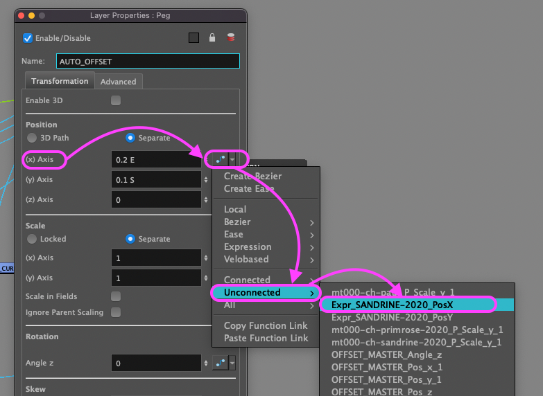

+++
date = '2026-08-26T17:09:09+02:00'
draft = false
title = 'Automating rimlights in Toon Boom Harmony : TPLs + Master Controller + expressions + Scripts'
tags = ['Toon Boom', 'Harmony', 'Compositing', 'Scripting', '2D']
categories = ["Compositing"]
keywords = ['compositing', 'animation 2D', 'scripting', 'toon boom', 'harmony', 'rimlight', 'master controller', 'script', 'scripting']
description = 'Discover how to automate the creation and tracking of rim lights in Toon Boom Harmony using TPLs, expressions, Master Controllers, and scripts for 2D compositing.'
summary = 'Case study on automating over 24,000 rim lights in Toon Boom Harmony for a 2D TV series: productivity gains, expressions, and TPLs.'
featured = 'featured.jpeg'
showHero = true
heroStyle = 'background'
layoutBackgroundBlur = true
showTableOfContents = true
+++


The challenge was to automate the creation of over 24,000 rim lights and ensure consistency in size, orientation, and color across every shot.



## Contexte

The rim light effect is a staple of 2D compositing. In Harmony, the standard technique involves using a *Highlight* node with its matte input connected to an *Apply-Peg-Transformation* node and a *Peg* node that controls the offset. For Season 2 of *Moi à ton âge © Monello*, this effect had to be applied consistently to all characters and props in every shot. This task becomes extremely time-consuming during the production of a TV series. A quick calculation illustrates this: 52 episodes, averaging 175 shots each, with an average of 3 characters or props per shot, results in a rough minimum of 24,000 rim lights to create. This was no small feat, considering that rim lighting was merely the baseline compositing requirement for the production. Only by automating the rim lights could the team meet the target quota of 11 shots per operator per day—a figure that actually reached 14 shots per operator per day. :rocket:.


## Gestion de la taille des rimlights

L'automatisation devait assurer la cohérence de la taille des rimlights suivant l'échelle (scale) des personnages/props (mentionnés assets ci-après) : pour une même échelle chaque asset devait avoir une rimlight de même taille et avoir la même taille pour une valeur de plan identique. De plus la différence de taille de la rimlight entre un asset en premier plan ou en arrière plan ne devait pas être linéaire afin que la rimlight reste visible sur un asset en arrière plan et ne soit pas trop présente sur un asset en premier plan.

## Gestion de l'orientation des rimlights

L'automatisation devait assurer que le décalage généré par le node *Apply-Peg-Transformation* en x/y soit identique pour chaque asset afin de donner l'impression que la source de lumière soit identique. De plus il fallait offrir la possibilité de flipper la rimlight si la source de lumière était centrale.

## Gestion de la colorimétrie des rimlights

Enfin l'automatisation devait assurer la cohérence colorimétrique de la rimlight pour chaque asset.

## Création de l'automatisation


**TPLs  +  EXPRESSION  +  MASTER-CONTROLLER  +  SCRIPT**



Schéma de fonctionnement simplifié



### RIMLIGHT CTRL (*TPL*)
TPL principal de l'automatisation, il contenait un node *Peg* lié à un *Master-Controller* qui permettait de choisir à la fois l'orientation et de contôler la taille de la *rimlight*. Par défaut il fallait placer le curseur sur le bord du *Master-Controller* pour obtenir la taille "default". En rapprochant le curseur près du centre, on pouvait diminuer la taille de la *rimlight* ce qui fut utiliser occasionnellement.
Le second node important était le node *HighLight* qui gérait la colorimétrie pour toutes les *rimlights* des assets (en liant les fonctions *Radius*, *color Red* / *Green* / *Blue* / *Alpha*, *Intensity*)


### Master Controller
Le *Master-Controller* avait pour mission de choisir la source lumineuse en fonction du plan. Un simple *grid-wizard* avec 4 points fut l'affaire, chaque angle réprésentant les sources lumineuses classiques haut/bas/gauche/droite. La direction de la source lumineuse était établie en fonction de celle du *background*.  

### Expression
L'expression avait pour rôle de calculer (formule mathématique) l'offset en x/y en fonction du *Master Controller* et de la taille (*scale*) du/des personnages/props.
La valeur de {asset} correspond au nom de l'asset (exemple : SANDRINE-2020)

####  Expression de position.X (*Expr_{asset}_offsetX*)
```javascript
sNode = {asset} // (string) fourni par script
scale = value( sNode + "_P_Scale_y", currentFrame)
scale = Math.atan(scale) / 3.3
angl = value("OFFSET_MASTER_Pos_x")
value = Math.abs(scale) * angl
```
####  Expression de position.Y (*Expr_{asset}_offsetY*)
```javascript
sNode = {asset} // (string) fourni par script
scale = value( sNode + "_P_Scale_y", currentFrame )
scale = Math.atan(scale) / 4
angl = value("OFFSET_MASTER_Pos_y")
value = -scale * angl
```

<div class="mt-6">

Afin qu'une expression puisse récupérer l'information *scale_y* d'un node *PEG*, il faut décalarer au préalable  la fonction *scale_y* dans la *XSheet* et évidemment la reconnecter à la fonction *scale_y* de ce node *PEG*

</div>


<div class="mt-6">

La fonction mathématique *Math.atan* permettait d'avoir un calcul non linéaire afin que l'offset de la rimlight augmente moins vite que le scale de l'asset. Important : *Math.atan* n'était pertinente que parce que la taille par défaut des assets était très grande, de telle manière que tout asset importé avait une valeur de scale < 1.

</div>

<div class="mt-6">

Le paramètre *currentFrame* permettait d'adapter dynamiquement la taille de l'offset en fonction de la valeur scale de l'asset à chaque frame du plan. Si l'asset grossissait/diminuait durant le plan, l'offset était automatiquement recalculé pour s'adapter (c'est toute la beauté des expressions :wink:).  

</div>

Ces expressions étaient reliées aux valeurs X/Y du node *Auto Offset Peg* du TPL RIMLIGHT_G. *cf (1) Node Peg Auto-Offset* :arrow_heading_down:

### RIMLIGHT_G (*TPL*)
Ce TPL (node groupe) appliqué à chaque asset contenait tous les nodes nécessaires pour l'effet rimlight : node  *Apply-Peg-Transformation* + node Peg *Auto Offset* (1), node *Highlight_BODY* (2), lié au HightLight du TPL RIMLIGHT CTRL et une multitude d'autres nodes pour assurer des fonctions supplémentaires : flip, cutter, adder, colorimétrie etc.

#### (1) Node Peg Auto-Offset
Les valeurs position.X & position.Y sont liées à l'expression déclarées précédemment.


#### (2) Node HighLight
Les valeurs *Radius*, *color Red* / *Green* / *Blue* / *Alpha*, *Intensity* étaient  réliées à celles du node HighLight de TPL RIMLIGHT CTRL.


### Colorimétrie
Le node *HighLight_BODY* qui génère la rimlight était paramétré en *Multiplicative*. Ce mode a 2 avantages :<br> 1 • Générer une HighLight qui garde la saturation de la couleur d'origine de l'asset ce qui évitait d'affadir les couleurs d'origine, <br>
2 - une des demandes pour les rimlights étaient qu'elles n'affectent pas la line des assets. Comme la couleur de la line des asset étaient un noir pur (R=0,G=0,B=0), le mode *Multiplicative* n'affectait pas la line car 0xn=0 quelque soit n. Du coup il était inutile de rajouter la line de l'asset à l'entrée *masque* du node *HighLight_BODY*. C'était un gros avantage car ça évitait de rajouter au *masque* du node *HighLight_BODY* la line du personnage, un calcul un moins mais surtout même si rajouter la line au *masque* n'aurait pas été compliqué techniquement, malheureusement le node *Line Art (isolate)* avec le paramètre *Flatten* n'est pas fiable à 100% (*à cause la complexité du rig et de l'agencement des nodes cutter*). Corriger ses erreurs aurait été vite très laborieux et perte de temps.

<div class="mt-6">
Mais le mode Multiplicative a aussi un inconvénient : les couleurs calculées par le node HighLight_BODY se faisant justement par multiplication, plus une couleur était foncée moins elle était affectée et inversement plus une couleur était claire plus elle était affectée. Pour homogénéiser ces valeurs, un node curves qui prenait en entrée les couleurs de l'asset rectifiait ses valeurs RBG qui étaient utilisées comme masque (node greyscale + Matte Ouput=true) pour être injectée en plus dans l'entrée masque du node HighLight_BODY pour venir pondérer ou accentuer l'effet.
</div>
<div class="mt-6">
Ce node curves était paramétré de façon générique pour marcher correctement pour chaque asset. Mais par soucis du détail, un node *curves* a été créé pour chaque asset récurrent (une douzaine) pour individualiser et optimiser le résultat de la rimlight, le script se chargeant de choisir le bon node *curves* en fonction du nom de l'asset.
</div>

### Script
Pierre angulaire de l'automatisation (*sans qui elle serait trop laborieuse à mettre en place*) un script avait pour rôle d'importer le TPL RIMLIGHT_CTRL et pour chaque asset présent dans la scène : importer un TPL RIMLIGHT_G, déclarer sa valeur *scale_y* , déclarer les 2 expressions (une pour position.X et une pour position.Y) puis les lier au peg Auto Offset de la rimlight, lier les valeurs *Radius*, *color Red* / *Green* / *Blue* / *Alpha*, *Intensity* au node *HighLight_BODY* et enfin sélectioner le bon node *curves*.

<div class="mt-8">
Ce script était executé lors du build-compositing de la scène Harmony afin que les opérateurs compo ouvrent une scène qui soit directement artistiquement éditable.
</div>



À 10 ans, Paul est un enfant tout ce qu’il y a de plus normal ! Sauf que... dès qu’un adulte lui dit les mots « Moi à ton âge », Paul est aussitôt propulsé à l'époque où son interlocuteur avait lui aussi 10 ans ! *© Monello* 

