
Le défi était d'automatiser la création 24000+ rimlights et d'assurer leur cohérence dans leur taille, leur orientation et leur colorimétrie entre chaque plan.




## Contexte

L'effet rimlight est un grand classique du compositing 2D. Pour la saison 2 de **Moi à ton âge** *© Monello* dont le compositing était fait par [Big Company](https://www.bigcompany.fr/), cet effet devait être systématiquement appliqué sur tous les personnages et les props pour chaque plan. Avec Harmony, la technique utilisée est simple et connue de tous en utilisant le node *Highlight* dont l'entrée *matte* est reliée à l'objet lui-même à travers un node *Apply-Peg-Transformation* et un node *Peg* qui gère son offset. Même si opération reste basique, elle devient très gourmande en temps s'il faut la systématiser pour tous les plans d'une série TV. Un simple calcul pour s'en rendre compte : 52 épisodes, 175 plans en moyenne et 3 personnages/props en moyenne plan => soit à la louche  ±24000 rimlight minimum à faire. Ce n'est pas une mince affaire sachant que l'effet rimlight n'était sur cette production que la base de la demande en compositing. Seule une automatisation des rimlights permettrait de tenir un quota souhaité soutenu de 11 plans / jour / opérateur. Ce fut 14 plans / jour / opérateur dans la réalité :hot_pepper:.


## Gestion de la taille des rimlights

L'automatisation devait assurer la cohérence de la taille des rimlights suivant l'échelle (scale) des personnages/props (mentionnés ***assets*** ci-après) : pour une même échelle chaque asset devait avoir une rimlight de même taille et avoir la même taille pour une valeur de plan identique. De plus la différence de taille de la rimlight entre un asset en premier plan ou en arrière plan ne devait pas être linéaire afin que la rimlight reste visible sur un asset en arrière plan et ne soit pas trop présente sur un asset en premier plan.

## Gestion de l'orientation des rimlights

L'automatisation devait assurer que le décalage en x/y généré par le node *Apply-Peg-Transformation* soit identique pour chaque asset afin de donner l'impression que la source de lumière soit identique. De plus il fallait offrir la possibilité de flipper la rimlight si la source de lumière était centrale.

## Gestion de la colorimétrie des rimlights

Enfin l'automatisation devait assurer la cohérence colorimétrique de la rimlight pour chaque asset.

## Création de l'automatisation


**TPLs  +  EXPRESSION  +  MASTER-CONTROLLER  +  SCRIPT**



Schéma de fonctionnement simplifié


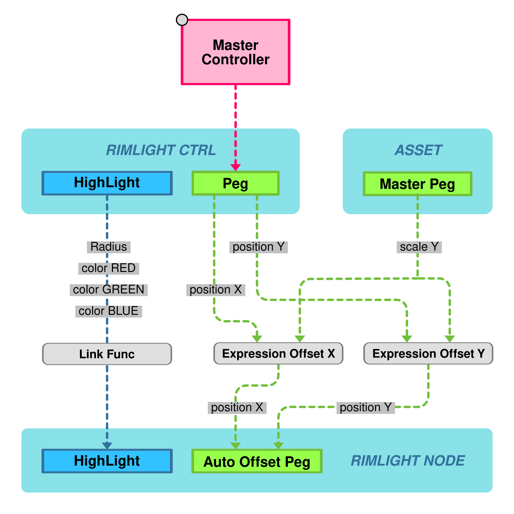

### RIMLIGHT CTRL (*TPL*)
TPL principal de l'automatisation, il contenait un node *Peg* dont les valeurs position x/y était contrôlées via un *Master-Controller* qui permettait de choisir à la fois l'orientation et de contôler la taille de la *rimlight*. Par défaut il fallait placer le curseur sur le bord du *Master-Controller* pour obtenir une taille normée et cohérente. En rapprochant le curseur près du centre, on pouvait diminuer la taille de la *rimlight* ce qui fut utiliser occasionnellement.
Le second node important était le node *HighLight* qui gérait la colorimétrie pour toutes les *rimlights* des assets, en liant les fonctions *Radius*, *color Red* / *Green* / *Blue* / *Alpha*, *Intensity* au node *HighLight* de chaque asset.

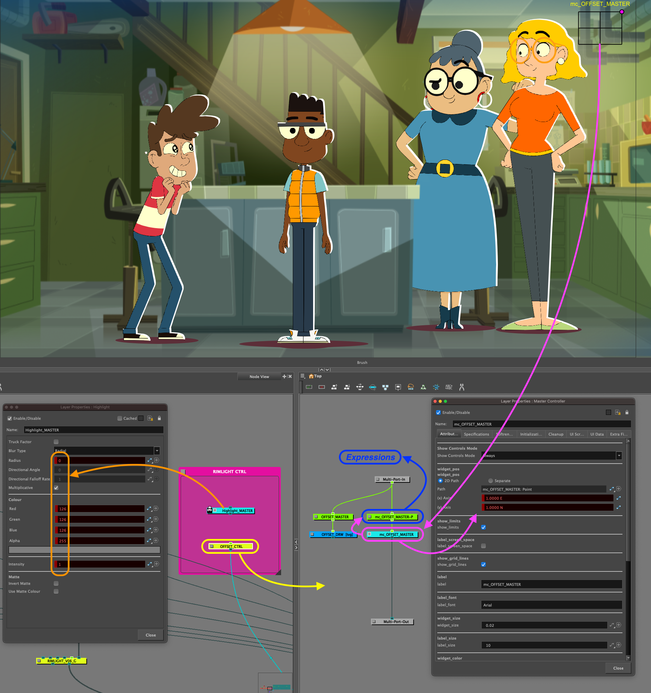

### Master Controller
Le *Master-Controller* avait pour mission de choisir la source lumineuse en fonction du plan. Un simple *grid-wizard* avec 4 points fut l'affaire, chaque angle réprésentant les sources lumineuses classiques haut/bas/gauche/droite. La direction de la source lumineuse était établie en fonction de celle du *background*.  

### Expression
L'expression avait pour rôle de calculer (formule mathématique) l'offset en x/y en fonction du *Master Controller* et de la taille (*scale*) du/des assets.
La valeur de **{asset}** correspond au nom de l'asset (exemple : mt000-ch-sandrine-2020)

####  Expression de position.X (*Expr_{asset}_offsetX*)
```javascript
sNode = {asset} // (string) fourni par script
scale = value( sNode + "_P_Scale_y", currentFrame)
scale = Math.atan(scale) / 3.3
angl = value("OFFSET_MASTER_Pos_x")
value = Math.abs(scale) * angl
```
####  Expression de position.Y (*Expr_{asset}_offsetY*)
```javascript
sNode = {asset} // (string) fourni par script
scale = value( sNode + "_P_Scale_y", currentFrame )
scale = Math.atan(scale) / 4
angl = value("OFFSET_MASTER_Pos_y")
value = -scale * angl
```

<div class="mt-6">

Afin qu'une expression puisse récupérer l'information *scale_y* d'un node *PEG*, il faut décalarer au préalable la fonction *scale_y* dans la *XSheet* (create Bézier) et évidemment la reconnecter à la fonction *scale_y* de ce même node *PEG*.

</div>

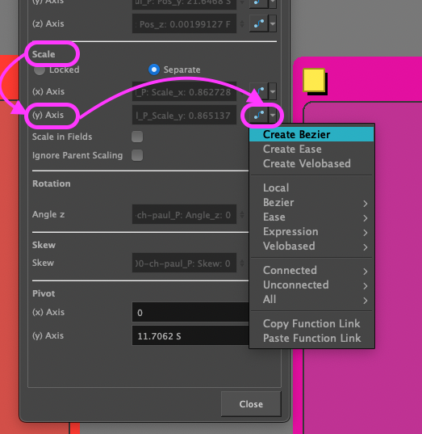
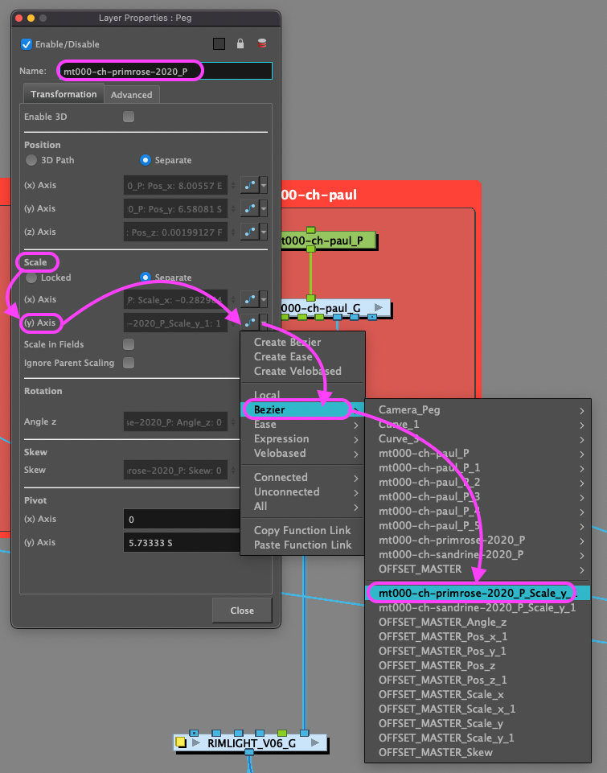

<div class="mt-6">


La fonction mathématique ***Math.atan*** permettait d'avoir un calcul non linéaire afin que l'offset de la rimlight augmente moins vite que le scale de l'asset. Important : ***Math.atan*** n'était pertinente que parce que la taille par défaut des assets était très grande, de telle manière que tout asset importé avait une valeur de ***scale < 1***.


</div>

<div class="mt-6">


Le paramètre ***currentFrame*** permettait d'adapter dynamiquement la taille de l'offset en fonction de la valeur scale de l'asset à chaque frame du plan. Si l'asset grossissait/diminuait durant le plan, l'offset était automatiquement recalculé pour s'adapter (c'est toute la beauté des expressions :wink:).  


</div>

[Ces expressions étaient reliées aux valeurs X/Y du node *Auto Offset Peg* du TPL RIMLIGHT_G](#node-peg-auto-offset)

### RIMLIGHT_G (*TPL*)
Ce TPL (node groupe) appliqué à chaque asset contenait tous les nodes nécessaires pour l'effet rimlight : node  *Apply-Peg-Transformation* + node Peg [*Auto Offset*](#node-peg-auto-offset), node [*Highlight_BODY*](#node-highlight) et une multitude d'autres nodes pour assurer des fonctions supplémentaires (flip, cutter, adder, intersect, peg, curl). Le node *RIMLIGHT_G* comprenait ainsi plusieurs entrées :
* une pour l'asset à rimlighter (**asset**)
* une pour rajouter un peg pour singulariser (**peg**)
* une pour le clean de la rimlight (**cut**)
* une pour ajouter des détails à la rimlight (**add**)
* une pour intersectionner la rimlight (**intersect**)
* une spéciale pour ajouter du détail au visage (**curl** ou Close-Up RimLight)

Deux sorties :
* le **composite** de l'asset + rimlight
* le **matte** de la rimlight pour utilisation ultérieure

Enfin le node *RIMLIGHT_G* avait ses propres *properties* pour flipper la rimlight et activer l'intersection si présente (pour une question de préviz openGL). *D'autres options ont été rajoutées au fur et à mesure de cas particulier récurrents*.

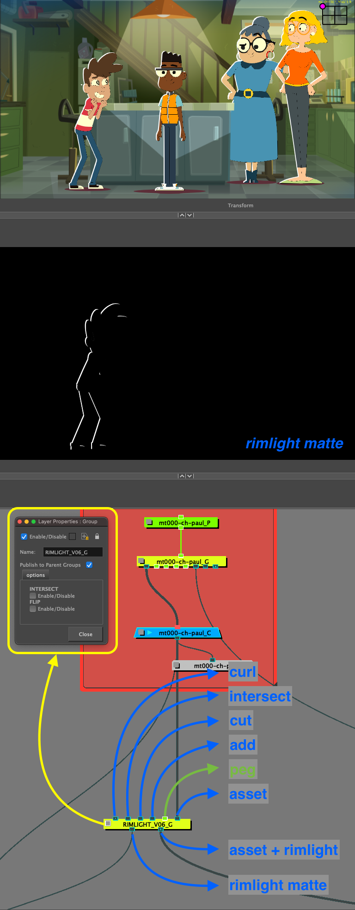

#### Node Peg Auto-Offset
Les valeurs *position_x* & *position_y* sont liées aux expressions déclarées précédemment.

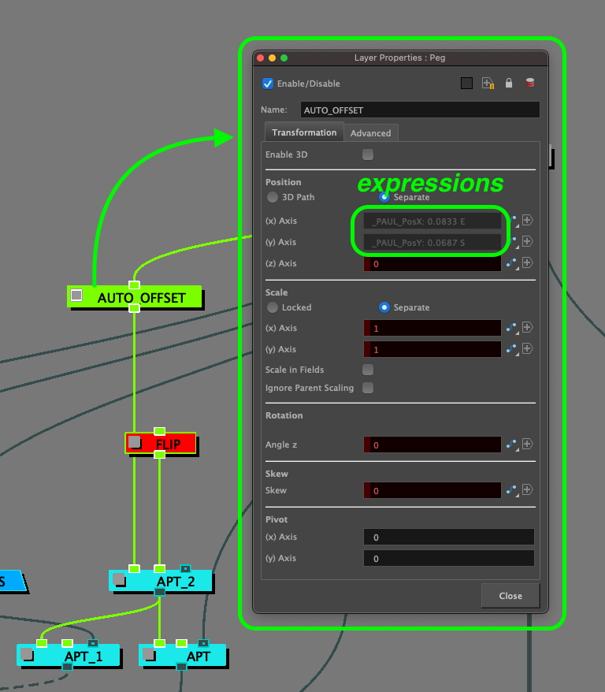

#### Node HighLight
Les valeurs *Radius*, *color Red* / *Green* / *Blue* / *Alpha*, *Intensity* étaient réliées à celles du node HighLight de TPL RIMLIGHT CTRL grâce à la fonction ***Paste Function Link***.
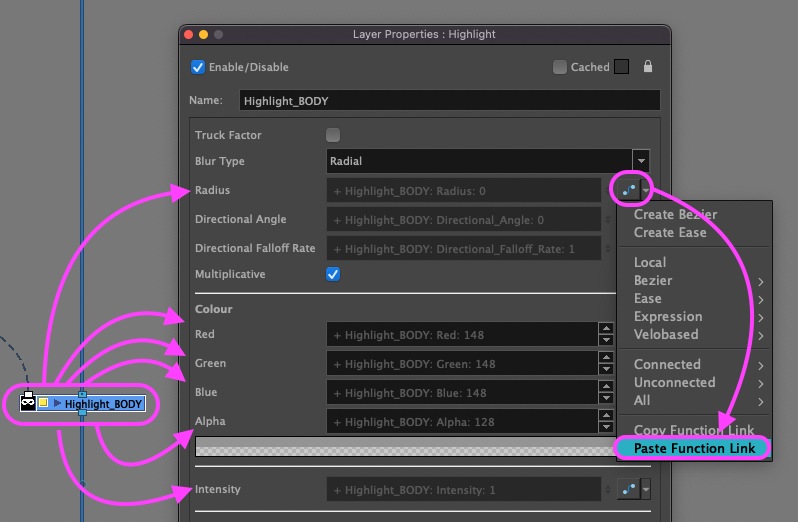

### Colorimétrie
Le node *HighLight_BODY* qui génère la rimlight était paramétré en ***Multiplicative***. Ce mode a 2 avantages : 
1. Générer une HighLight qui garde la saturation de la couleur d'origine de l'asset ce qui évitait d'affadir les couleurs d'origine,
2. une des demandes pour les rimlights étaient qu'elles n'affectent pas la line des assets. Comme la couleur de la line des asset étaient un noir pur (R=0,G=0,B=0), le mode *Multiplicative* n'affectait pas la line car 0 x n = 0 quelque soit n. Du coup il était inutile de soustraire la line de l'asset à l'entrée *matte* du node *HighLight_BODY*. C'était un gros avantage car ça évitait de soustraire au *matte* du node *HighLight_BODY* la line du personnage. Un calcul en moins mais surtout, même si soustraire la line au *matte* était techniquement simple, le node *Line Art (isolate)* avec le paramètre *Flatten* n'est pas fiable à 100% (*à cause la complexité du rig et de l'agencement des nodes cutter*). Corriger ses erreurs aurait été vite très laborieux et perte de temps.

<div class="mt-6">

Mais le mode *Multiplicative* a aussi un inconvénient : les couleurs calculées par le node *HighLight_BODY* se faisant justement par ***multiplication***, plus une couleur était foncée moins elle était affectée et inversement plus une couleur était claire plus elle était affectée. Pour homogénéiser ces valeurs, un node curves qui prenait en entrée les couleurs de l'asset rectifiait ses valeurs RBG qui étaient utilisées comme *matte* (node LUMA_MATTE =  *greyscale* + *Matte Ouput = true*) pour être injectée en soustraction du matte généré pour venir pondérer l'effet.
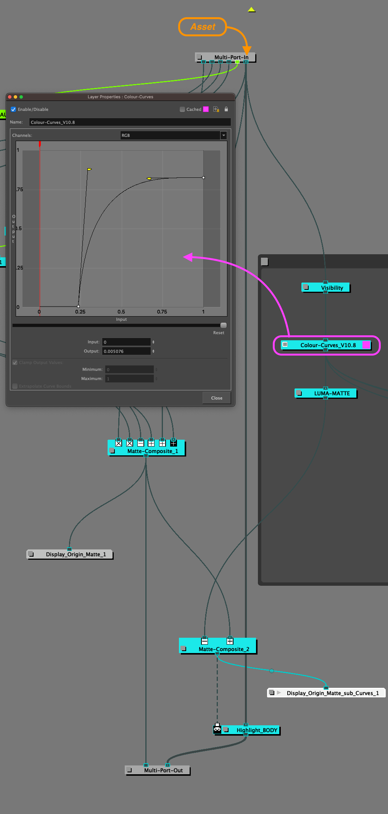
En comparant l'affichage un node *display* sous le matte d'origine et sous celui du matte corrigé par le node *curves*, on voit distinguement les zones du matte qui ont été pondérées (notamment les lumières hautes pour pas qu'elles "brûlent"). 
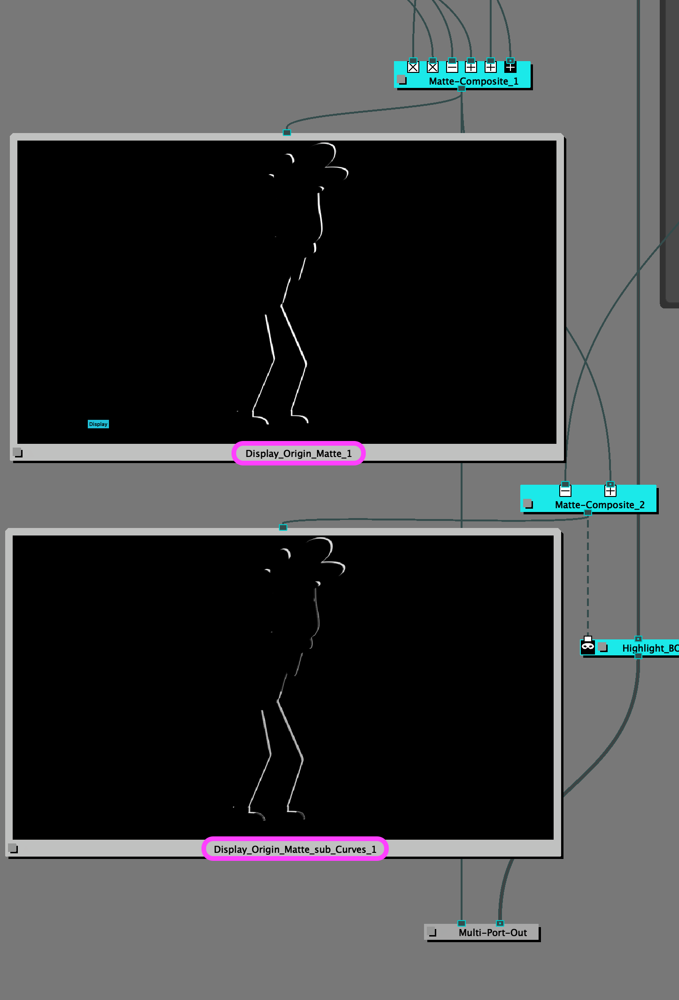

</div>
<div class="mt-6">

Ce node *curves* était paramétré de façon générique pour marcher correctement pour chaque asset. Mais par soucis du détail, un node *curves* a été créé pour chaque asset récurrent (une douzaine) pour individualiser et optimiser le résultat de la rimlight, le script se chargeant de choisir le bon node *curves* en fonction du nom de l'asset.

</div>
<div class="mt-6">

Pour personnaliser le résultat, au lieu de modifier les valeurs RGB de façon globale, c'est  chaque canal R, V, B qui a été modifié individuellement. Ça permettait de contôler le matte en fonction des couleurs spécifiques de l'asset.
</div>


Exemple avec l'asset Primerose-2020

Avec le node *curves* et son préset par défaut, la rimlight était trop prononcée sur la chevelure, la peau et pas assez sur son T-shirt. En analysant chaque canal RVB, il était possible de voir quel canal il fallait modifier pour soit baisser ou soit augmenter le niveau.
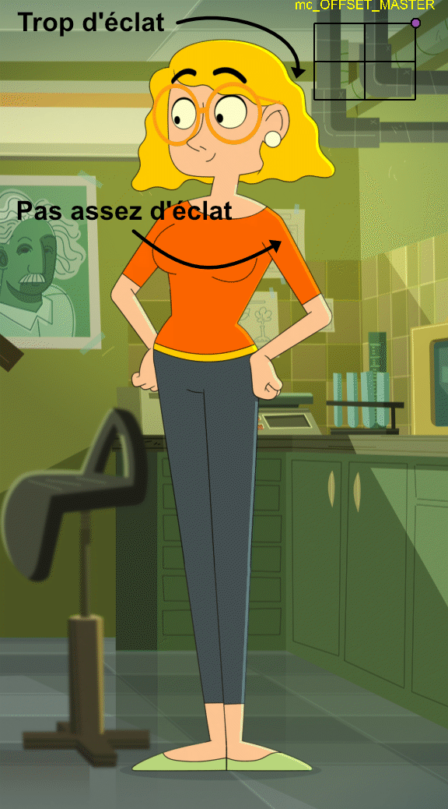
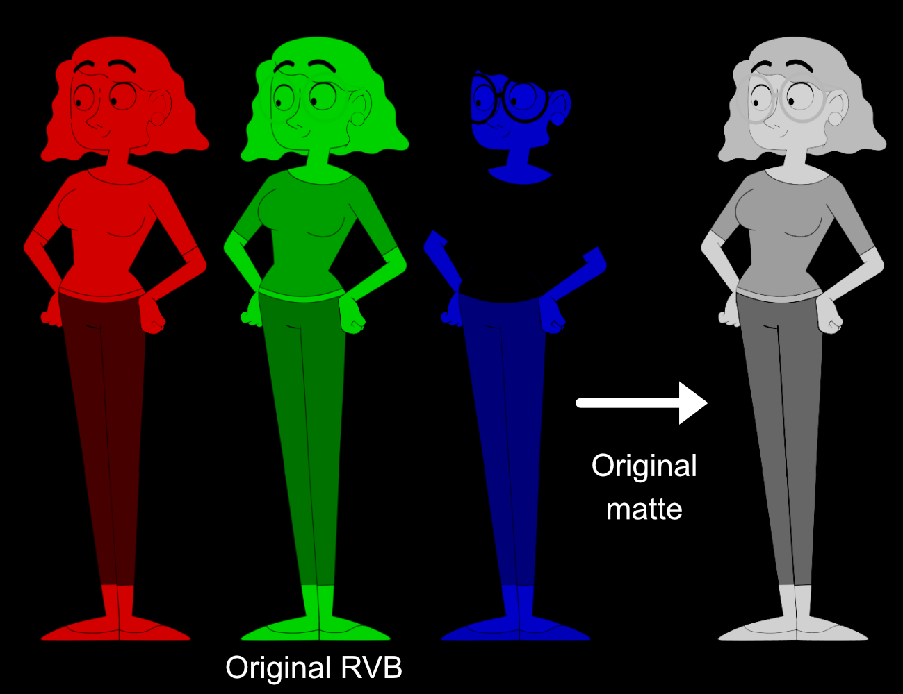
En appliquant de nouveaux réglages canal par canal, on modifiait la luma du matte soustrait au matte de la rimlight généré. La différence se faisant principalement sur le *canal Green* c'est clui-ci qui a été modifié pour augmenter la valeur luma sur les cheveux et baisser la valeur luma finale pour le T-Shirt. Le canal Red a été aplati à 0 pour récupérer les pertes de luma dû à la modification du canal Green et le canal Blue a été laisser tel quel n'ayant ici aucun incidence sur les couleurs jaunes/oranges.
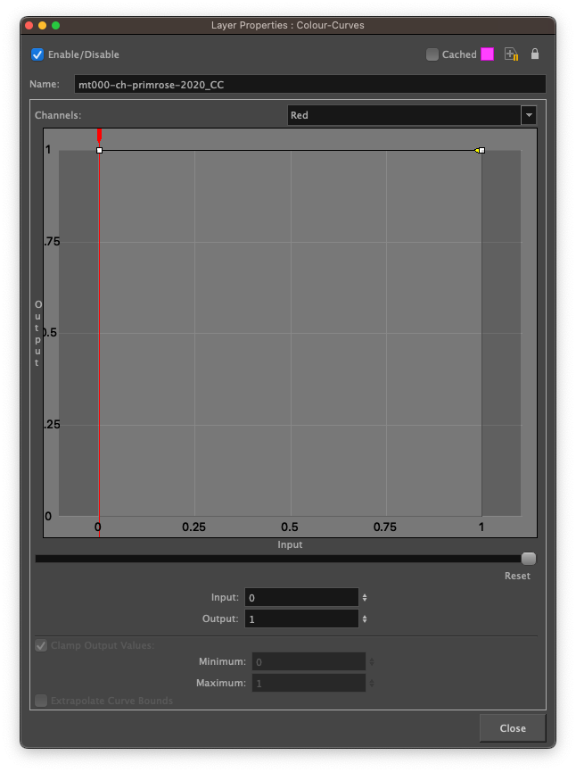
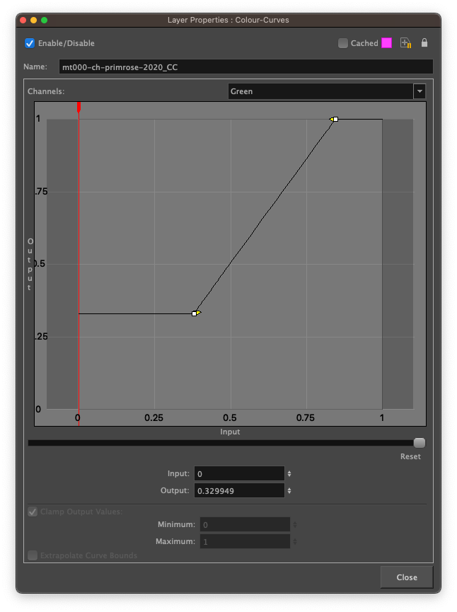
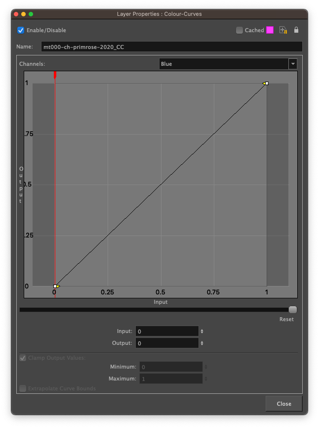
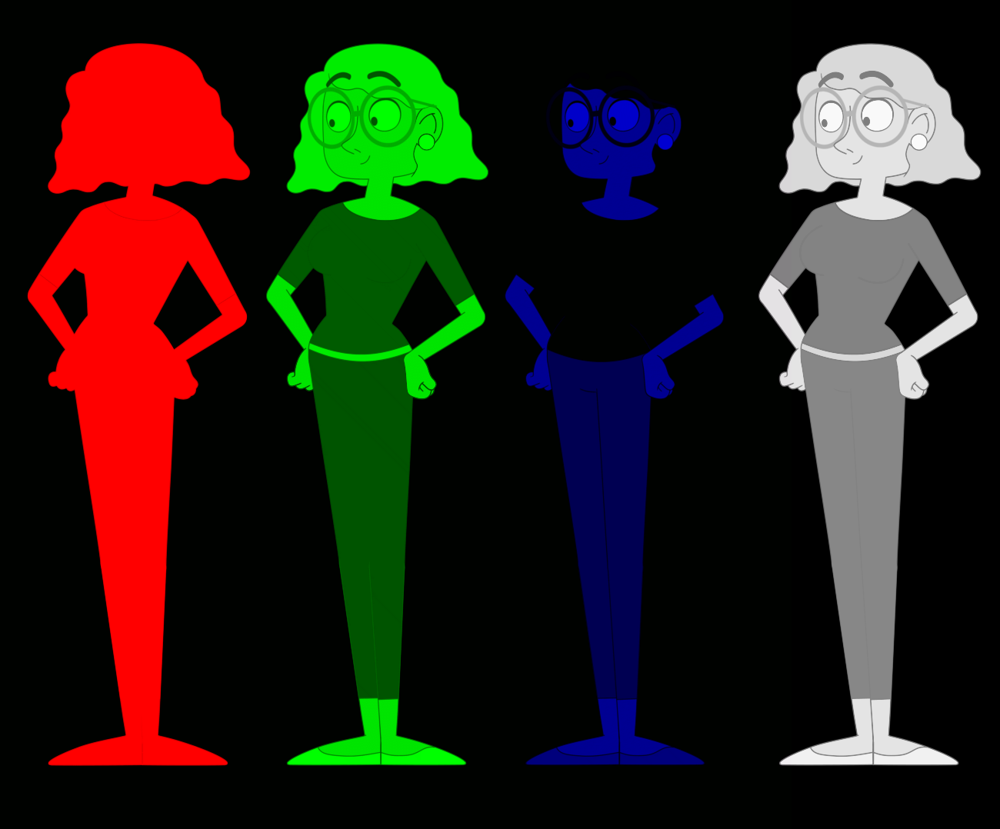
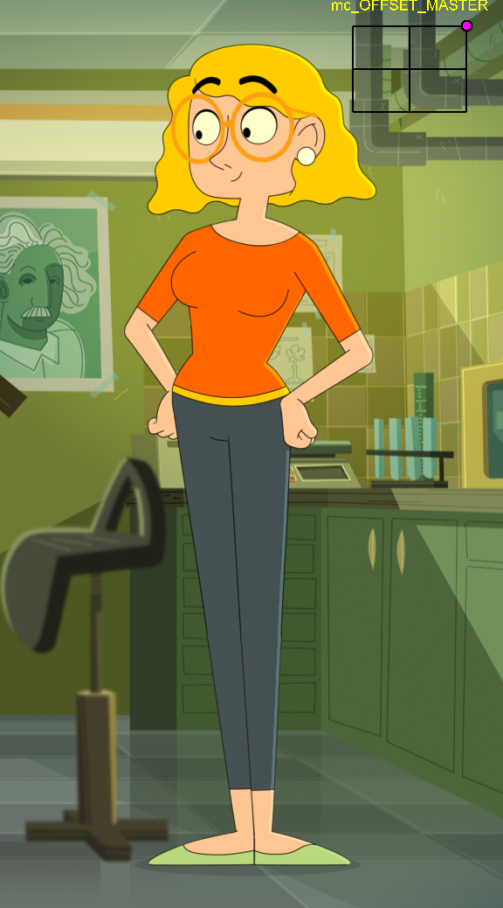

### Script
Pierre angulaire de l'automatisation (*sans qui elle serait trop laborieuse à mettre en place*) un script avait pour rôle d'importer le TPL RIMLIGHT_CTRL et pour chaque asset présent dans la scène : importer un TPL RIMLIGHT_G, déclarer sa valeur *scale_y* , déclarer les 2 expressions (une pour *position_x* et une pour *position_y*) puis les lier au peg *Auto Offset* de la rimlight, lier les valeurs *Radius*, *color Red* / *Green* / *Blue* / *Alpha*, *Intensity* au node *HighLight_BODY* et enfin sélectioner le bon node *curves*.

<div class="mt-8">
Ce script était executé lors du build-compositing de la scène Harmony afin que les opérateurs compo ouvrent une scène qui soit directement artistiquement éditable.
</div>



À 30 ans, Paul est un enfant tout ce qu’il y a de plus normal ! Sauf que... dès qu’un adulte lui dit les mots « Moi à ton âge », Paul est aussitôt propulsé à l'époque où son interlocuteur avait lui aussi 10 ans ! *© Monello* 

